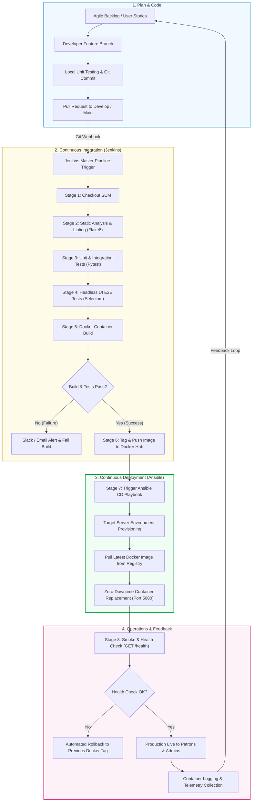

# Phase 1: Agile Methodology, User Stories, Sprint Planning, and DevOps Workflow
**Project Name:** CI/CD Pipeline for a Digital Library Search Portal  
**Domain:** DevOps Engineering & Agile Development  
**Phase:** 1 — Planning, Scope, and Architecture  

---

## 1. Core Agile User Stories & Acceptance Criteria

### User Story 1 (US-01): Real-Time Catalog Search
- **As a** student or researcher,
- **I want to** search the digital catalog by keyword across book titles, authors, and genres,
- **So that** I can instantly find learning materials and check whether they are available for checkout.

#### Acceptance Criteria (Gherkin Format):
```gherkin
Scenario: Successful search with matching results
  Given the digital library contains registered books with titles "DevOps Handbook" and "Clean Code"
  When the user inputs "DevOps" into the live search bar
  Then the catalog table should dynamically update to display "DevOps Handbook"
  And the non-matching book "Clean Code" should not be visible in the results.

Scenario: Search with no matching records
  Given the user is on the library search portal
  When the user queries a keyword "Quantum Computing 101" which does not exist in the database
  Then the portal should display an alert stating "No matching books found in the catalog"
  And offer an action to clear the search filter.
```

---

### User Story 2 (US-02): Adding New Resources (Catalog Management)
- **As a** librarian administrator,
- **I want to** register new books into the catalog with title, author, category, and initial status,
- **So that** the inventory remains up to date for library patrons.

#### Acceptance Criteria:
```gherkin
Scenario: Admin submits valid book details
  Given the administrator accesses the "Add New Book" form
  When valid values are submitted for "Title", "Author", "ISBN", and "Category"
  Then the record should be committed to the SQLite database
  And the catalog view and summary statistics should increment the total book count immediately.

Scenario: Admin submits missing required fields
  Given the administrator leaves the "Title" or "Author" field empty
  When the administrator clicks "Add Book"
  Then the form should prevent submission with client-side and server-side validation errors
  And no record should be inserted into the database.
```

---

### User Story 3 (US-03): Modifying Resource Availability Status
- **As a** library desk attendant,
- **I want to** toggle or update a book's status between `Available`, `Checked Out`, and `Reserved`,
- **So that** patrons immediately see accurate inventory availability.

#### Acceptance Criteria:
```gherkin
Scenario: Transitioning a book from Available to Checked Out
  Given an existing book has status "Available"
  When the administrator selects the status dropdown or action button to "Checked Out"
  Then an asynchronous PUT request should update the status in SQLite
  And the status badge should turn amber ("Checked Out")
  And the dashboard metric for "Checked Out Books" should increment by 1.
```

---

### User Story 4 (US-04): Summary Dashboard Metrics
- **As a** library director,
- **I want to** view high-level metric cards indicating Total Titles, Available Books, Checked Out Books, and Category counts,
- **So that** I have immediate situational awareness of library utilization.

#### Acceptance Criteria:
```gherkin
Scenario: Loading the dashboard view
  Given the library database contains 10 total books, 7 Available and 3 Checked Out
  When any user visits the root URL `/`
  Then the summary metric cards must display "10 Total Books", "7 Available", and "3 Checked Out"
  And the statistics should reflect real-time database counts without requiring manual cache flushes.
```

---

### User Story 5 (US-05): Continuous Integration Quality Gate
- **As a** DevOps engineer,
- **I want to** have every code commit automatically tested and packaged in an isolated Docker container by Jenkins,
- **So that** defective or untested code never reaches the deployment environment.

#### Acceptance Criteria:
```gherkin
Scenario: Clean pull request build
  Given a developer commits code to the repository
  When Jenkins detects the commit webhook
  Then Jenkins triggers the declarative pipeline
  And all unit tests (pytest) and Selenium UI tests must pass with 0 errors
  And a Docker image tagged with the build ID must be built and published.

Scenario: Breaking regression failure
  Given a developer introduces a syntax or logic bug in `app.py`
  When the Jenkins pipeline executes the test stage
  Then pytest reports a non-zero exit code
  And the build is flagged as FAILED, halting downstream deployment steps and notifying the team.
```

---

## 2. Product Backlog & Definition of Done (DoD)

### 2.1 Prioritized Product Backlog

| Backlog ID | Priority | Epic | Description | Story Points | Target Milestone |
| :--- | :--- | :--- | :--- | :--- | :--- |
| **PB-01** | Highest | Core App | Setup Flask server, SQLite schema, and baseline UI with Tailwind | 3 | Sprint 1 |
| **PB-02** | High | Core App | Implement CRUD routes (Create, View, Update Status, Delete) | 5 | Sprint 1 |
| **PB-03** | High | Core App | Implement real-time client-side / API keyword search & dashboard metrics | 3 | Sprint 1 |
| **PB-04** | High | DevOps/VCS | Initialize Git repository, branch protections, and commit standard | 2 | Sprint 1 |
| **PB-05** | High | Testing | Implement comprehensive unit and API integration tests using Pytest | 5 | Sprint 2 |
| **PB-06** | High | Container | Author multi-stage `Dockerfile` and local `docker-compose.yml` | 3 | Sprint 2 |
| **PB-07** | Critical | CI/CD | Setup Jenkins environment with Docker & pipeline plugins | 5 | Sprint 2 |
| **PB-08** | Critical | CI/CD | Create Declarative `Jenkinsfile` for Build & Test stages | 5 | Sprint 2 |
| **PB-09** | High | Testing | Develop Selenium automated UI regression tests for search and add flows | 5 | Sprint 3 |
| **PB-10** | High | Container | Automated Docker Hub registry tag and push stage | 3 | Sprint 3 |
| **PB-11** | High | CD/Config | Author Ansible playbooks for server configuration and Docker run | 5 | Sprint 3 |
| **PB-12** | High | CD/Config | Automate continuous delivery pipeline stage linking Jenkins to Ansible | 5 | Sprint 3 |
| **PB-13** | Medium | Ops/Health| Implement automated health check & rollback mechanism | 3 | Sprint 3 |
| **PB-14** | Medium | Ops/Health| Configure container logging and operational metrics collection | 2 | Sprint 3 |
| **PB-15** | Medium | Governance| Compile final test reports, pipeline documentation, and project closure | 2 | Sprint 3 |

### 2.2 DevOps Definition of Done (DoD)
A backlog item or user story is considered **Done** only when all of the following conditions are met:
1. **Code Completeness:** Functional requirements implemented and refactored adhering to PEP8 standards.
2. **Unit & Integration Test Coverage:** Minimum $80\%$ code coverage with passing `pytest` suite.
3. **Automated End-to-End Validation:** Selenium headless tests execute and pass without flakiness.
4. **Static Analysis & Linting:** Zero high-severity lint errors or code-smell warnings.
5. **Container Compliance:** Application builds successfully into a self-contained, lightweight Docker image without root security vulnerabilities.
6. **Pipeline Verification:** Code cleanly builds and passes all stages in the Jenkins declarative pipeline.
7. **Automated Deployment:** Deployed onto target environment via Ansible playbook without manual intervention.
8. **Smoke & Health Verification:** Endpoint responds with HTTP 200 on health-check routes.
9. **Documentation:** Inline docstrings, API specifications, and README updated.

---

## 3. Sprint Plan & Agile Kanban Structure

The 15 tasks are structured across a 3-Sprint Scrum cycle (or Kanban Swimlane system):

```
+-----------------------------------------------------------------------------------------+
| SPRINT 1: Foundation & Application Core (Tasks 01 - 04)                                |
| Goal: Deliver a fully functional, locally testable Library Search Web Application.     |
+-----------------------------------------------------------------------------------------+
| SPRINT 2: Containerization & Continuous Integration Pipeline (Tasks 05 - 08)           |
| Goal: Establish automated build verification, container parity, and Jenkins CI gates.  |
+-----------------------------------------------------------------------------------------+
| SPRINT 3: Automated UI Testing, Continuous Deployment & Operations (Tasks 09 - 15)     |
| Goal: Complete Selenium test harness, Ansible CD automation, health checks & telemetry. |
+-----------------------------------------------------------------------------------------+
```

### Sprint Breakdown Table

| Sprint | Task ID | Task Title | Owner | Dependencies | Output Artifact |
| :--- | :--- | :--- | :--- | :--- | :--- |
| **Sprint 1** | Task 01 | Scope & Problem Definition | Product Owner | None | `01_Problem_and_Scope.md` |
| | Task 02 | Agile Plan & Workflow | Scrum Master | Task 01 | `02_Agile_Plan_and_Workflow.md` |
| | Task 03 | Architecture & App Baseline | Fullstack Dev | Task 01 | `app.py`, `templates/index.html` |
| | Task 04 | Git Branching Strategy & Repo Setup | DevOps Eng | Task 03 | `.gitignore`, Git Repository |
| **Sprint 2** | Task 05 | Unit & Integration Test Suite | QA Engineer | Task 03 | `tests/test_app.py` |
| | Task 06 | Dockerfile & Container Optimization | DevOps Eng | Task 03 | `Dockerfile`, `.dockerignore` |
| | Task 07 | Docker Compose Local Orchestration | DevOps Eng | Task 06 | `docker-compose.yml` |
| | Task 08 | Jenkins Server & Agent Setup | DevOps Eng | Task 04, 06 | Jenkins Server Instance |
| **Sprint 3** | Task 09 | Declarative Jenkinsfile Pipeline | DevOps Eng | Task 05, 08 | `Jenkinsfile` |
| | Task 10 | Headless Selenium UI Automation | QA Engineer | Task 03, 09 | `tests/test_ui_selenium.py` |
| | Task 11 | Docker Hub Registry Publishing | DevOps Eng | Task 06, 09 | Docker Hub Repository |
| | Task 12 | Ansible Server Provisioning Playbook | DevOps Eng | Task 08 | `ansible/provision.yml` |
| | Task 13 | Continuous Deployment via Ansible | DevOps Eng | Task 11, 12 | `ansible/deploy.yml` |
| | Task 14 | Automated Health Check & Rollback | DevOps Eng | Task 13 | Rollback Script & Jenkins Stage |
| | Task 15 | Monitoring, Telemetry & Documentation | All Hands | Task 14 | Final Lab Report & Metrics Dashboard |

---

## 4. End-to-End DevOps Workflow Diagram

The following Mermaid diagram maps the end-to-end continuous integration, continuous delivery, and operational monitoring workflow:


