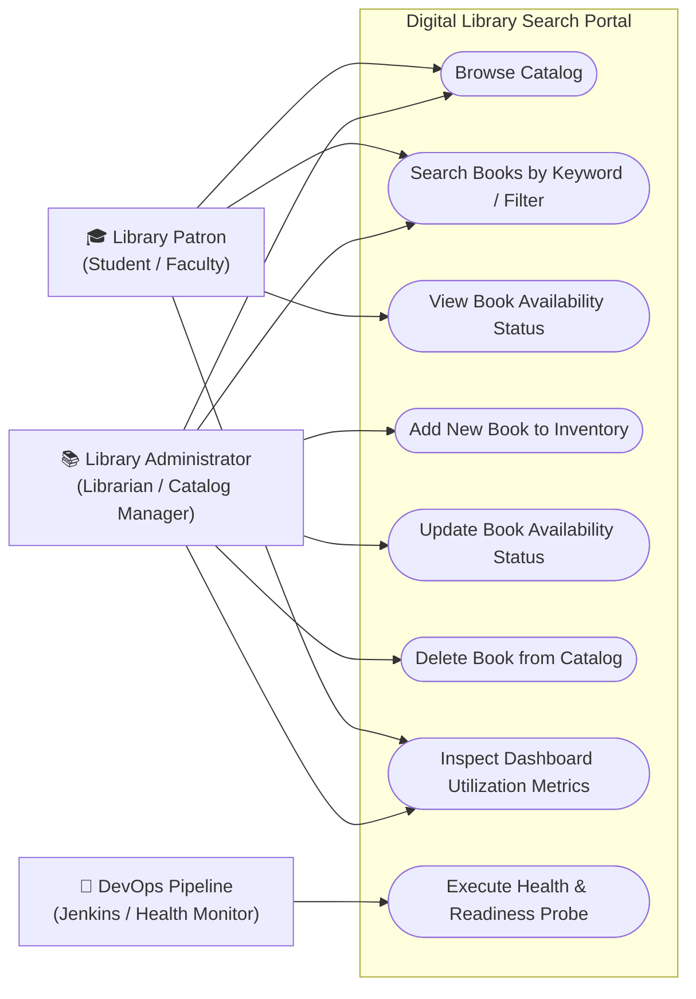
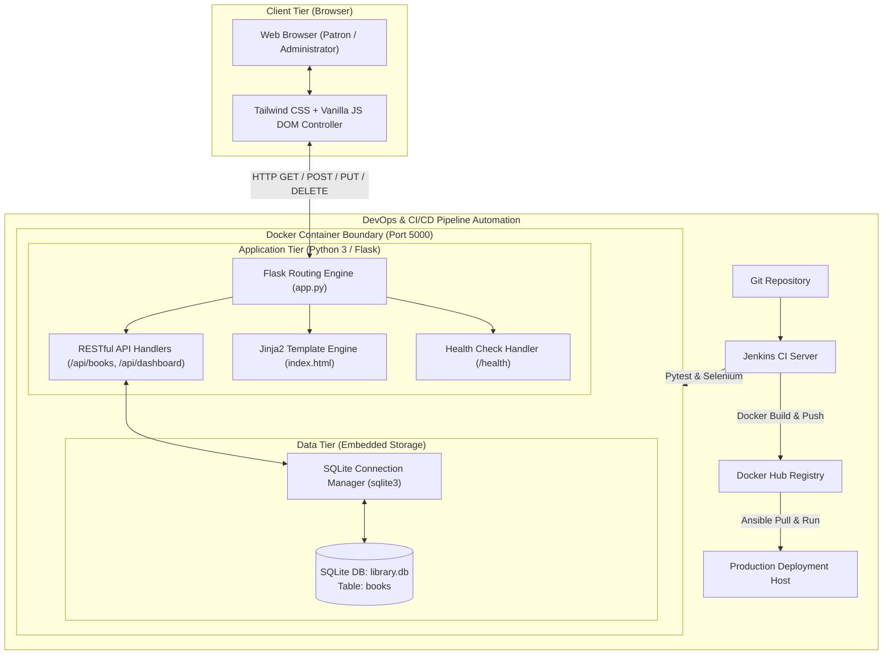

# Phase 1: Software Requirements Specification (SRS), Architecture, and Data Model
**Project Name:** CI/CD Pipeline for a Digital Library Search Portal  
**Domain:** Software Architecture & System Engineering  
**Phase:** 1 — Planning, Scope, and Architecture  

---

## 1. Software Requirements Specification (SRS) Summary

### 1.1 Functional Requirements (FR)

| Requirement ID | Module / Feature | Specification |
| :--- | :--- | :--- |
| **FR-01** | **Summary Dashboard** | The system must calculate and render real-time summary indicators: Total Books, Available Books, Checked Out Books, and Category metrics. |
| **FR-02** | **Catalog Search** | Users can search books by keyword across `title`, `author`, `isbn`, or `category`. The search must support both instant query updates and filter resets. |
| **FR-03** | **Book Creation (Add)**| Administrators can insert new catalog entries with `title`, `author`, `isbn`, `category`, and initial `status`. Duplicate ISBN numbers must be rejected. |
| **FR-04** | **Status Modification** | Administrators can update a book's status between `Available`, `Checked Out`, and `Reserved` via single-click actions or direct status update endpoints. |
| **FR-05** | **Catalog Deletion** | Administrators can delete a book record by its unique identifier, with immediate recalculation of dashboard metrics. |
| **FR-06** | **Health Check** | The system must expose a `/health` endpoint returning system status and database connectivity for automated DevOps smoke tests. |

### 1.2 Non-Functional Requirements (NFR)

| Category | Requirement Specification | Metric / Target |
| :--- | :--- | :--- |
| **Performance** | API response times for catalog queries under standard loads. | $\le 200\text{ ms}$ for 95th percentile responses. |
| **Reliability** | Consistent data integrity with atomic SQLite transactions. | Zero database corruption on sudden server termination. |
| **Maintainability**| Clean separation of concerns (MVC architecture: Flask routing, SQLite storage, Tailwind UI). | Modularity score allowing isolated component upgrades. |
| **Portability** | Full container parity between local developer machine, Jenkins CI agent, and production VM. | Packaged in standard OCI/Docker container. |
| **Usability** | Fully responsive web interface with clean accessibility and no page flickers on search. | WCAG 2.1 AA compliant contrast and mobile responsiveness. |

---

## 2. System Architecture & Use-Case Diagrams

### 2.1 Use-Case Diagram



---

### 2.2 Multi-Tier Application Architecture Diagram



---

## 3. Data Model & Database Schema

The Digital Library relies on a lightweight, ACID-compliant **SQLite3** relational database schema.

### 3.1 Entity Relationship / Table Structure: `books`

```sql
CREATE TABLE IF NOT EXISTS books (
    id INTEGER PRIMARY KEY AUTOINCREMENT,
    title TEXT NOT NULL,
    author TEXT NOT NULL,
    isbn TEXT UNIQUE NOT NULL,
    category TEXT NOT NULL DEFAULT 'General',
    status TEXT NOT NULL CHECK (status IN ('Available', 'Checked Out', 'Reserved')) DEFAULT 'Available',
    created_at TIMESTAMP DEFAULT CURRENT_TIMESTAMP
);
```

### 3.2 Data Dictionary

| Column Name | Data Type | Constraints | Description |
| :--- | :--- | :--- | :--- |
| `id` | `INTEGER` | `PRIMARY KEY AUTOINCREMENT` | Unique identifier for each library item. |
| `title` | `TEXT` | `NOT NULL` | Full title of the publication or textbook. |
| `author` | `TEXT` | `NOT NULL` | Author(s) or publishing entity. |
| `isbn` | `TEXT` | `UNIQUE NOT NULL` | Standard International Book Number. |
| `category` | `TEXT` | `NOT NULL`, Default: `'General'` | Genre / Subject (e.g., Software Engineering, Data Science). |
| `status` | `TEXT` | `NOT NULL`, Value Check | Current availability: `'Available'`, `'Checked Out'`, `'Reserved'`. |
| `created_at` | `TIMESTAMP` | Default: `CURRENT_TIMESTAMP` | System timestamp when record was entered. |

---

## 4. RESTful API Specifications

| Method | Endpoint | Request Body | Success Response (Code) | Description |
| :--- | :--- | :--- | :--- | :--- |
| `GET` | `/` | None | `200 OK` (HTML) | Renders the primary dashboard and catalog interface. |
| `GET` | `/health` | None | `{"status": "UP", "database": "connected"}` (`200 OK`) | Application health and readiness probe for DevOps monitoring. |
| `GET` | `/api/books` | Query Params: `?q=<term>&status=<val>` | `{"books": [...], "count": N}` (`200 OK`) | Retrieve all books or filter by keyword and status. |
| `GET` | `/api/books/<id>` | None | `{"book": {...}}` (`200 OK`) | Retrieve detailed metadata for a specific book ID. |
| `POST` | `/api/books` | `{"title": "...", "author": "...", "isbn": "...", "category": "...", "status": "..."}` | `{"message": "Book added successfully", "id": N}` (`201 Created`) | Insert a new book into the library catalog. |
| `PUT` | `/api/books/<id>` | `{"status": "Checked Out"}` (or updated fields) | `{"message": "Book updated successfully"}` (`200 OK`) | Update status or details of an existing book. |
| `DELETE`| `/api/books/<id>` | None | `{"message": "Book deleted successfully"}` (`200 OK`) | Remove a book from the catalog. |
| `GET` | `/api/dashboard/stats`| None | `{"total": 12, "available": 8, "checked_out": 3, "reserved": 1, "categories": 5}` (`200 OK`) | Returns aggregated statistics for the metric cards. |

### 4.1 Sample JSON Responses

#### Catalog Search Response (`GET /api/books?q=DevOps`):
```json
{
  "count": 1,
  "books": [
    {
      "id": 1,
      "title": "The DevOps Handbook",
      "author": "Gene Kim, Jez Humble, Patrick Debois",
      "isbn": "978-1942788002",
      "category": "DevOps",
      "status": "Available",
      "created_at": "2026-10-01 10:00:00"
    }
  ]
}
```

#### Dashboard Summary Response (`GET /api/dashboard/stats`):
```json
{
  "total": 5,
  "available": 3,
  "checked_out": 1,
  "reserved": 1,
  "categories": 4
}
```
