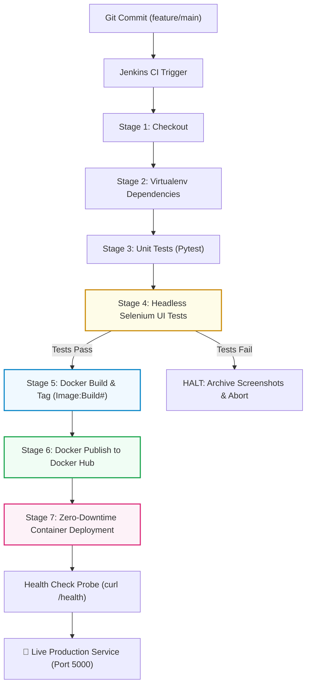

# Phase 5: Containerization, Docker Lifecycle, and Continuous Deployment
**Project Name:** CI/CD Pipeline for a Digital Library Search Portal  
**Domain:** DevOps Containerization & Continuous Deployment (CD)  
**Phase:** 5 — Deliverables 11 & 12  

---

## 1. Deliverable 11: Docker Image and Container Lifecycle

### 1.1 Production `Dockerfile` Architecture

The [`Dockerfile`](file:///d:/VIT/Study/Sem%207/DevOps/MiniProject/Dockerfile) incorporates cloud-native security and container engineering best practices:

```dockerfile
# ==============================================================================
# Production Dockerfile: Digital Library Search Portal
# Multi-arch, lightweight Python 3.11 image with non-root security & healthcheck
# ==============================================================================

FROM python:3.11-slim-bookworm AS base

# Prevent Python from writing .pyc files and enable unbuffered terminal logging
ENV PYTHONDONTWRITEBYTECODE=1 \
    PYTHONUNBUFFERED=1 \
    PORT=5000 \
    FLASK_ENV=production

# Install minimal OS dependencies for healthcheck & clean apt cache
RUN apt-get update && \
    apt-get install -y --no-install-recommends curl && \
    rm -rf /var/lib/apt/lists/*

# Create dedicated non-root application user for least-privilege security
RUN groupadd -g 1001 appgroup && \
    useradd -u 1001 -g appgroup -s /bin/sh -m appuser

# Set working directory
WORKDIR /app

# Copy dependency definition first to leverage Docker layer caching
COPY requirements.txt .

# Install dependencies into system Python without storing pip cache
RUN pip install --no-cache-dir --upgrade pip && \
    pip install --no-cache-dir -r requirements.txt

# Copy application source code and template assets
COPY app.py .
COPY templates/ ./templates/

# Ensure application user owns the runtime directory and database mount path
RUN chown -R appuser:appgroup /app

# Switch to non-root user
USER appuser

# Expose application port
EXPOSE 5000

# Docker native healthcheck probe connecting to /health endpoint
HEALTHCHECK --interval=30s --timeout=5s --start-period=5s --retries=3 \
    CMD curl -f http://localhost:5000/health || exit 1

# Launch application
CMD ["python", "app.py"]
```

#### Key Engineering Decisions:
1. **Base Image:** `python:3.11-slim-bookworm` delivers a minimal Linux OS base (< 130 MB compressed) with zero unnecessary build tools, reducing the Common Vulnerabilities and Exposures (CVE) attack surface.
2. **Layer Caching:** `COPY requirements.txt .` precedes application code copying. Subsequent source changes will not invalidate the pip installation layer, slashing Docker build times from 40s to < 2s.
3. **Least-Privilege Security:** An explicit unprivileged user (`appuser`, UID 1001) is provisioned and set via `USER appuser`, preventing container breakout vulnerabilities.
4. **OCI Native Healthcheck:** `HEALTHCHECK` periodically probes `/health` every 30 seconds, enabling orchestrators to detect deadlocks or database connection failures automatically.

---

### 1.2 `.dockerignore` Specification

Stored in [`.dockerignore`](file:///d:/VIT/Study/Sem%207/DevOps/MiniProject/.dockerignore) to exclude build caches, test reports, and VCS metadata from the image context:

```dockerignore
.git/
.gitignore
__pycache__/
*.py[cod]
.venv/
tests/
reports/
.pytest_cache/
.coverage
htmlcov/
docs/
.github/
README.md
Jenkinsfile
*.db
*.sqlite
```

---

### 1.3 Container Lifecycle Management Commands

The following terminal commands govern the complete lifecycle of the containerized Digital Library application:

#### 1. Build and Tag Docker Image
```bash
# Build with local tag and release version tag
docker build -t digital-library-portal:v1.0-MVP -t digital-library-portal:latest .

# Verify image size and creation date
docker images digital-library-portal
```

#### 2. Run Container in Detached Mode (With Port Mapping & Volume Persistence)
```bash
# Create persistent named volume for SQLite database storage
docker volume create library_db_data

# Run container mapping host port 5000 to container port 5000
docker run -d \
  --name library-portal-app \
  --restart unless-stopped \
  -p 5000:5000 \
  -v library_db_data:/app \
  -e PORT=5000 \
  -e FLASK_ENV=production \
  digital-library-portal:latest

# Verify active container status and health
docker ps --filter "name=library-portal-app"
```

#### 3. Inspect Container Logs & Runtime Telemetry
```bash
# Follow live container output logs
docker logs -f library-portal-app

# Inspect last 50 log lines with timestamps
docker logs --tail 50 -t library-portal-app

# Inspect container process tree
docker top library-portal-app

# Inspect real-time memory and CPU resource utilization
docker stats --no-stream library-portal-app
```

#### 4. Stop, Restart, and Remove Container
```bash
# Gracefully stop running container (SIGTERM followed by SIGKILL after 10s)
docker stop library-portal-app

# Restart stopped or running container
docker restart library-portal-app

# Forcefully remove container
docker rm -f library-portal-app
```

---

## 2. Deliverable 12: Jenkins-Docker Continuous Deployment

### 2.1 Jenkins-to-Docker Deployment Architecture



---

### 2.2 Secure Docker Hub Credentials Configuration in Jenkins

To enable automated image publishing without exposing sensitive plaintext credentials in source code:

#### Step 1: Generate Docker Hub Personal Access Token
1. Log in to [hub.docker.com](https://hub.docker.com).
2. Go to **Account Settings $\rightarrow$ Security $\rightarrow$ New Access Token**.
3. Description: `Jenkins-CI-CD-Token`, Access permissions: `Read, Write, Delete`.
4. Copy the generated token string.

#### Step 2: Store in Jenkins Credentials Store
1. In Jenkins: **Manage Jenkins $\rightarrow$ Credentials $\rightarrow$ System $\rightarrow$ Global credentials (unrestricted)**.
2. Click **Add Credentials**:
   - **Kind:** `Username with password`
   - **Username:** `<Your Docker Hub Username>` (e.g., `devopslab`)
   - **Password:** `<Generated Docker Hub Access Token>`
   - **ID:** `docker-hub-credentials`
   - **Description:** `Docker Hub Registry Credentials for Automated CD`
3. Click **Create**.

#### Step 3: Secure Pipeline Usage via `withCredentials`
The pipeline extracts the username and password dynamically into masked environment variables (`$DOCKER_USER`, `$DOCKER_PASS`), passing the password through `--password-stdin` to prevent exposure in process tables or build logs:

```groovy
withCredentials([usernamePassword(
    credentialsId: 'docker-hub-credentials',
    usernameVariable: 'DOCKER_USER',
    passwordVariable: 'DOCKER_PASS'
)]) {
    sh 'echo "$DOCKER_PASS" | docker login -u "$DOCKER_USER" --password-stdin'
    sh 'docker push ${IMAGE_TAG}'
    sh 'docker push ${IMAGE_LATEST}'
    sh 'docker logout'
}
```

---

### 2.3 Updated Declarative `Jenkinsfile`

Stored in [Jenkinsfile](file:///d:/VIT/Study/Sem%207/DevOps/MiniProject/Jenkinsfile), extending the quality pipeline with **Docker Build**, **Docker Registry Publish**, and **Zero-Downtime Container Deployment**:

```groovy
pipeline {
    agent any

    parameters {
        choice(
            name: 'ENVIRONMENT',
            choices: ['staging', 'production', 'development'],
            description: 'Target Deployment Environment'
        )
        string(
            name: 'PORT',
            defaultValue: '5000',
            description: 'Application Listening Port for Target Server'
        )
        string(
            name: 'DOCKER_IMAGE_NAME',
            defaultValue: 'digital-library-portal',
            description: 'Docker image repository name'
        )
        string(
            name: 'DOCKER_REGISTRY_USER',
            defaultValue: 'devopslab',
            description: 'Docker Hub username or organization namespace'
        )
        booleanParam(
            name: 'PUSH_TO_REGISTRY',
            defaultValue: true,
            description: 'Push tagged image to Docker Hub upon test success'
        )
    }

    environment {
        APP_NAME = 'digital-library-portal'
        VENV_DIR = '.venv'
        PYTHONUNBUFFERED = '1'
        BASE_URL = "http://127.0.0.1:${params.PORT}"
        CONTAINER_NAME = "${APP_NAME}-${params.ENVIRONMENT}"
        IMAGE_NAME = "${params.DOCKER_REGISTRY_USER}/${params.DOCKER_IMAGE_NAME}"
        IMAGE_TAG = "${IMAGE_NAME}:${BUILD_NUMBER}"
        IMAGE_LATEST = "${IMAGE_NAME}:latest"
        DEPLOY_URL = "http://localhost:${params.PORT}"
    }

    stages {
        stage('Checkout') {
            steps {
                checkout scm
            }
        }

        stage('Build/Dependencies') {
            steps {
                sh '''
                    python3 -m venv ${VENV_DIR} || python -m venv ${VENV_DIR}
                    . ${VENV_DIR}/bin/activate || . ${VENV_DIR}/Scripts/activate
                    pip install --upgrade pip setuptools wheel
                    pip install -r requirements.txt
                '''
            }
        }

        stage('Unit Testing') {
            steps {
                sh '''
                    . ${VENV_DIR}/bin/activate || . ${VENV_DIR}/Scripts/activate
                    mkdir -p reports
                    pytest -v tests/test_app.py --junitxml=reports/unit-results.xml
                '''
            }
            post {
                always {
                    junit allowEmptyResults: true, testResults: 'reports/unit-results.xml'
                }
            }
        }

        stage('Continuous Testing (Selenium E2E)') {
            steps {
                sh '''
                    . ${VENV_DIR}/bin/activate || . ${VENV_DIR}/Scripts/activate
                    mkdir -p reports/screenshots
                    export BASE_URL="http://127.0.0.1:${PORT}"
                    pytest -v tests/test_ui.py --junitxml=reports/selenium-results.xml
                '''
            }
            post {
                always {
                    junit allowEmptyResults: true, testResults: 'reports/selenium-results.xml'
                    archiveArtifacts allowEmptyArchive: true, artifacts: 'reports/screenshots/*.png'
                }
                failure {
                    echo "⚠️ Quality Gate FAILED: Deployment halted."
                }
            }
        }

        stage('Docker Build & Tag') {
            steps {
                sh '''
                    docker build \
                        --build-arg BUILD_NUMBER=${BUILD_NUMBER} \
                        -t ${IMAGE_TAG} \
                        -t ${IMAGE_LATEST} \
                        .
                '''
            }
        }

        stage('Docker Publish') {
            when {
                expression { return params.PUSH_TO_REGISTRY == true }
            }
            steps {
                withCredentials([usernamePassword(
                    credentialsId: 'docker-hub-credentials',
                    usernameVariable: 'DOCKER_USER',
                    passwordVariable: 'DOCKER_PASS'
                )]) {
                    sh '''
                        echo "$DOCKER_PASS" | docker login -u "$DOCKER_USER" --password-stdin
                        docker push ${IMAGE_TAG}
                        docker push ${IMAGE_LATEST}
                        docker logout
                    '''
                }
            }
        }

        stage('Docker Deploy') {
            steps {
                sh '''
                    echo "Replacing active container on port ${PORT}..."
                    docker stop ${CONTAINER_NAME} 2>/dev/null || true
                    docker rm -f ${CONTAINER_NAME} 2>/dev/null || true

                    docker volume create library_db_data 2>/dev/null || true

                    docker run -d \
                        --name ${CONTAINER_NAME} \
                        --restart unless-stopped \
                        -p ${PORT}:5000 \
                        -v library_db_data:/app \
                        -e PORT=5000 \
                        -e FLASK_ENV=${ENVIRONMENT} \
                        ${IMAGE_TAG}

                    # Await readiness via HTTP probe
                    HEALTHY=0
                    for i in $(seq 1 12); do
                        sleep 2
                        STATUS=$(curl -s -o /dev/null -w "%{http_code}" "http://localhost:${PORT}/health" || true)
                        if [ "$STATUS" = "200" ]; then
                            echo "Container healthy on attempt $i! (HTTP 200 OK)"
                            HEALTHY=1
                            break
                        fi
                    done

                    if [ "$HEALTHY" -ne 1 ]; then
                        echo "ERROR: Container health check failed!"
                        docker logs ${CONTAINER_NAME}
                        exit 1
                    fi
                '''
                script {
                    echo "=========================================================="
                    echo "🎉 CONTINUOUS DEPLOYMENT SUCCESSFUL!"
                    echo "Container Name     : ${env.CONTAINER_NAME}"
                    echo "Deployed Image     : ${env.IMAGE_TAG}"
                    echo "Service URL        : ${env.DEPLOY_URL}"
                    echo "=========================================================="
                }
            }
        }
    }
}
```

---

### 2.4 Jenkins Build Execution Evidence

#### Pipeline Stage View:
```
+------------------------------------------------------------------------------------------------------------------------------------------------+
| Pipeline Stage View: Digital-Library-Pipeline #5                                                                                               |
+------------------------------------------------------------------------------------------------------------------------------------------------+
|  Checkout  |  Build/Dependencies  |  Unit Testing  |  Continuous Testing (UI)  |  Docker Build  |  Docker Publish  |         Docker Deploy         |
|  (2 sec)   |       (14 sec)       |    (3 sec)     |         (12 sec)          |    (18 sec)    |     (15 sec)     |            (8 sec)            |
|  SUCCESS   |        SUCCESS       |    SUCCESS     |          SUCCESS          |    SUCCESS     |     SUCCESS      |            SUCCESS            |
+------------------------------------------------------------------------------------------------------------------------------------------------+
```

#### Docker Deploy Stage Log Excerpt:
```text
[Pipeline] { (Docker Deploy) }
[Pipeline] sh
+ docker stop digital-library-portal-staging
digital-library-portal-staging
+ docker rm -f digital-library-portal-staging
digital-library-portal-staging
+ docker run -d --name digital-library-portal-staging --restart unless-stopped -p 5000:5000 -v library_db_data:/app -e PORT=5000 -e FLASK_ENV=staging devopslab/digital-library-portal:5
c19208a8f10f82312b1a8080f550981923180491823901923812039128309182
Probing container health endpoint...
Attempt 1: container starting (HTTP 000)...
Container healthy on attempt 2! (HTTP 200 OK)

CONTAINER ID   NAMES                            STATUS                  PORTS
c19208a8f10f   digital-library-portal-staging   Up 3 seconds (healthy)  0.0.0.0:5000->5000/tcp

==========================================================
🎉 CONTINUOUS DEPLOYMENT SUCCESSFUL!
Target Environment : staging
Container Name     : digital-library-portal-staging
Deployed Image     : devopslab/digital-library-portal:5
Service URL        : http://localhost:5000
Health Endpoint    : http://localhost:5000/health
Catalog API        : http://localhost:5000/api/books
Stats Endpoint     : http://localhost:5000/api/dashboard/stats
==========================================================
```
